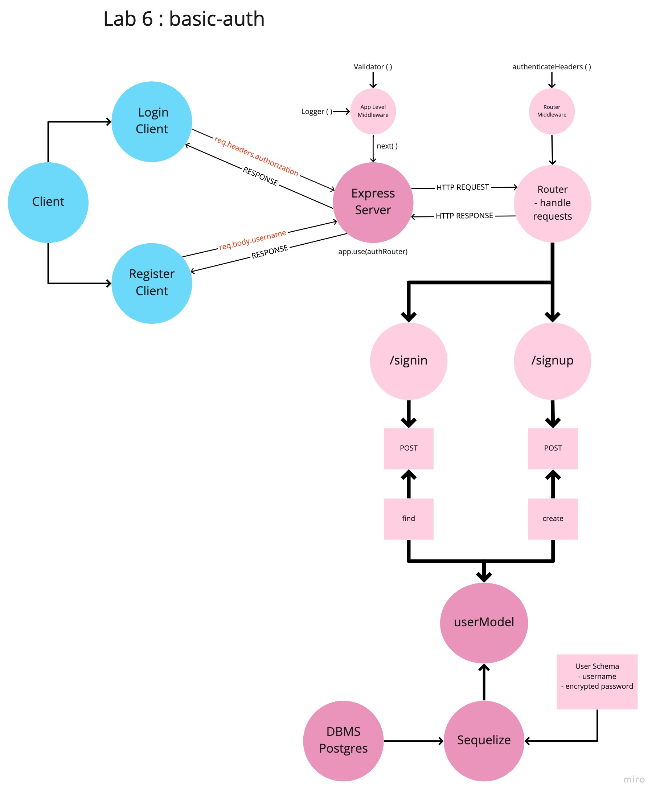
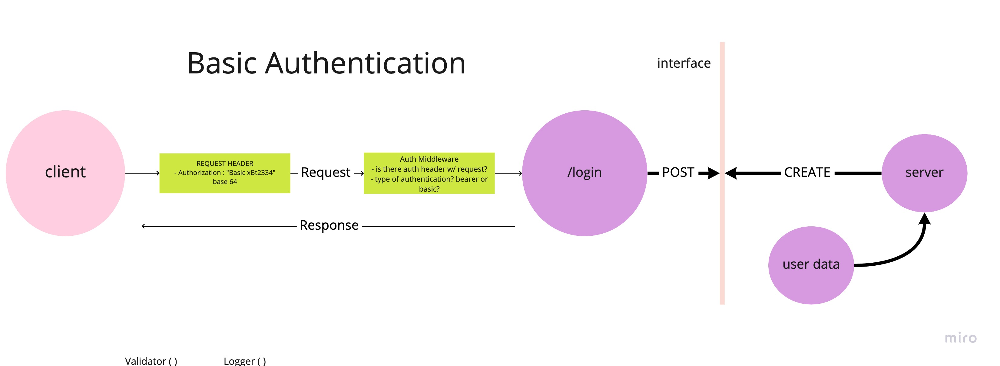

<h1 align="center"> Hola, welcome to basic auth 👋 </h1>
<p>
  
  <a href="https://github.com/antoni909/api-server#readme" target="_blank">
    
  </a>
  <a href="https://github.com/antoni909/api-server/graphs/commit-activity" target="_blank">
    
  </a>
  <a href="https://github.com/antoni909/api-server/blob/master/LICENSE" target="_blank">
    
  </a>
</p>

> Authentication System Phase 1: Deploy an Express server that implements Basic Authentication, with signup and signin capabilities, using a Postgres database for storage.

### 🏠 [GitHub Repo](https://github.com/antoni909/basic-auth)

### ✨ [Heroku Production Deployment](https://basic-auth.herokuapp.com/)

### Routes

Endpoint:

  ```sh
    /register
  
    /login
  ```

### UML




### Techonology Used

```sh
    "base-64": "^1.0.0",
    "bcrypt": "^5.0.1",
    "cors": "^2.8.5",
    "dotenv": "^10.0.0",
    "express": "^4.17.1",
    "pg": "^8.7.1",
    "sequelize": "^6.6.5",
    "sqlite3": "^5.0.2"
    "jest": "^27.2.4",
    "supertest": "^6.1.6"
```

### CRUD / REST

POST route for /register

    Accepts either a JSON object or FORM Data with the keys “username” and “password”.
    Creates a new user record in a Postgres database.
    Returns a 201 with the created user record.

POST route for /login.

    Use your basic authentication middleware to perform the actual login task.
    When validated, sends JSON users record


### DOCS USED

[Express and Express Router](https://expressjs.com/en/4x/api.html#router.route)
[Sequelize](https://sequelize.org/master/)
[JEST](https://archive.jestjs.io/docs/en/getting-started.html)
[SuperTest](https://www.npmjs.com/package/supertest)

### Project Details

[Home Repo](https://github.com/antoni909/basic-auth)

[PR - dev to main](https://github.com/antoni909/basic-auth/pull/2)

[Assignment Instructions - Lab 06](./assignment.md);

[Research Notes](./notes.md)

### Install

```sh

npm i

```

### Usage

```sh
npm run dev
```

### Run tests

```sh
npm run test
```

### Author

👤 **Lorenzo Ortega**

* Github: [@antoni909](https://github.com/antoni909)
* LinkedIn: [@https:\/\/www.linkedin.com\/in\/lorenzo-ortega-antoni\/](https://linkedin.com/in/https:\/\/www.linkedin.com\/in\/lorenzo-ortega-antoni\/)

### 🤝 Contributing

Contributions, issues and feature requests are welcome!<br />Feel free to check [issues page](https://github.com/antoni909/server-deployment-practice/issues). You can also take a look at the [contributing guide](https://github.com/antoni909/server-deployment-practice/blob/master/CONTRIBUTING.md).

### Show your support

Give a ⭐️ if this project helped you!

### 📝 License

This project is [MIT](https://github.com/antoni909/server-deployment-practice/blob/master/LICENSE) licensed.

Copyright © 2021 [Lorenzo Ortega](https://github.com/antoni909)<br />

***
_This README was generated with ❤️ by [readme-md-generator](https://github.com/kefranabg/readme-md-generator)_
